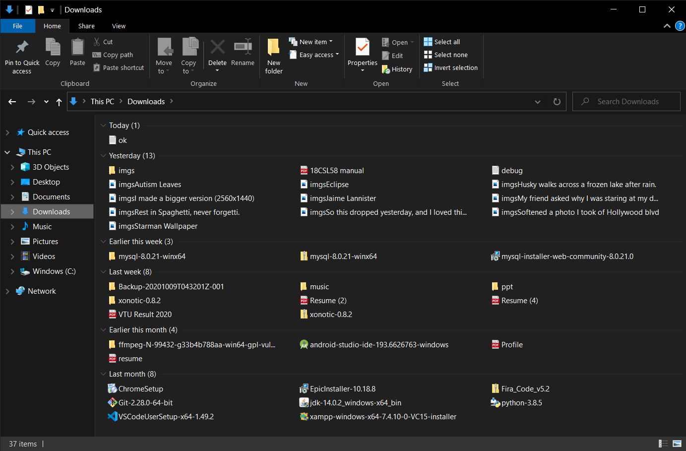
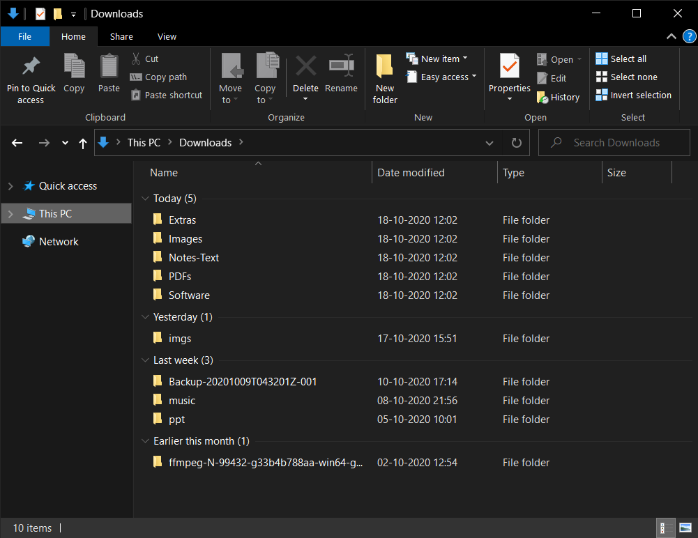
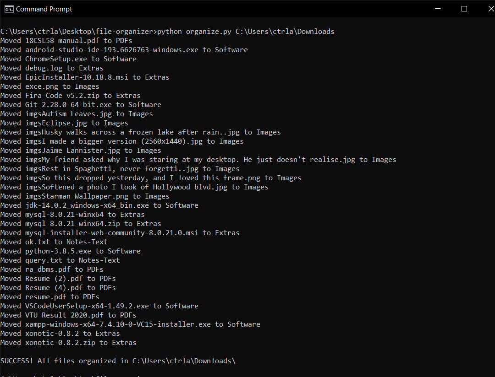

# file-organizer

Automatically organizes files in your computer

## Usage

`python organize.py <location>`

## Example

`python organize.py C:\Users\ctrla\Downloads`

## Pics

### Before

### After

### Output

### Errors

